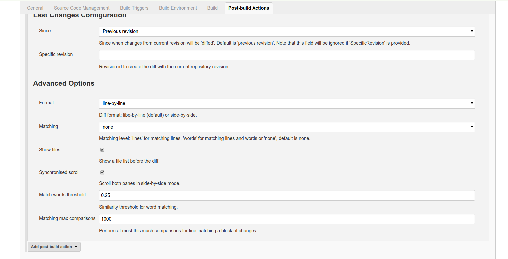

= Last Changes Plugin
:toc: preamble
:sectanchors:
:sectlink:
:numbered:
:tip-caption: :bulb:
:note-caption: :information_source:
:important-caption: :heavy_exclamation_mark:
:caution-caption: :fire:
:warning-caption: :warning:

[quote]
____
The simplest way to know what has changed on your Jenkins builds!
____

image:https://travis-ci.org/jenkinsci/last-changes-plugin.svg[Build Status (Travis CI), link=https://travis-ci.org/jenkinsci/last-changes-plugin]

Last Changes is a *Jenkin plugin* that shows _rich VCS diffs_ between builds.

IMPORTANT: Only `Git` and `Svn` based projects are supported.

== Introduction

The plugin uses https://diff2html.rtfpessoa.xyz/[diff2html^] to show last changes of a given build, example:

image::https://github.com/jenkinsci/last-changes-plugin/blob/master/images/last-changes03.png?raw=true[]

Or using side-by-side configuration:

image::https://raw.githubusercontent.com/jenkinsci/last-changes-plugin/master/images/last-changes05.png[]

NOTE: Last changes means `compare current repository revision with an old revision`. By default the plugin will diff current and previous revision.

== Objectives

The main objective of this plugin is to have _fast_ access to what has changed on a Jenkins build.

Another interesting aspect is that it can easily help to find the `root cause` of a `failing build` by highlighting what has changed.

TIP: Use `sinceLastSuccessfulBuild` option to diff against the last successful build revision.

And finally the plugin _shines_ in a https://en.wikipedia.org/wiki/Continuous_delivery[*continuous delivery*^] environment, where each _commit_ generates a release candidate.

== How it works?

. This plugin expects `.git` or `.svn` folders present on your build workspace and will use it to retrieve repository information .
. While your job runs the plugin reads your build workspace to retrieve the current VCS revision;
. The diff between `actual` and a `previous` revision will be stored; Note that the `previous revision` can be:
+
* A provided revision id;
* Revision of `Last successful build`;
* Revision of `Last tag`;
+
NOTE: By default previous revision is `current revision -1`.
+
TIP: You can use https://wiki.jenkins.io/display/JENKINS/Parameterized+Build[parameters] in `specificRevision` parameter. In case of git, expressions like `HEAD^{tree}` or `HEAD^^` can be used.
. The `diff` for each build can be viewed later in html format.

IMPORTANT: To get most from this plugin use `periodically SCM pooling` to trigger your builds, http://www.nailedtothex.org/roller/kyle/entry/articles-jenkins-poll[more details here^].

== Usage

After installation just activate the post build action named *Publish Last Changes*.

. Activate build action
+
image:images/last-changes-activation.png[]
. Last changes menu should be available
+
image:images/last-changes01.png[]
. Build changes history
+
image:images/last-changes02.png[]
. Last changes menu is available for builds that published changes
+
image:images/last-changes04.png[]

== Configuration

The setup is done via `build configuration`:

image:images/last-changes-config.png[]

IMPORTANT: If *SpecificRevision* parameter is provided then *Since* configuration will be ignored and the diff will be done with provided revision id.

Advanced configuration reflects https://github.com/rtfpessoa/diff2html#configuration[diff2html options^]:

== Jenkins pipeline step

Following is an example of pipeline step using this plugin:

----
node {
      stage ('Build') {
           svn 'https://subversion.assembla.com/svn/cucumber-json-files/trunk/'
           step([$class: 'LastChangesPublisher', format: 'LINE', matchWordsThreshold: '0.25', matching: 'NONE', matchingMaxComparisons: '1000', showFiles: true, synchronisedScroll: true, previousRevision: ''])

      }

}
----

=== Pipeline script DSL

Since version `1.0.10` it is possible to use the _lastChanges()_ shortcut in pipeline DSL:

----
node {
     git 'https://github.com/jenkinsci/last-changes-plugin.git'
     lastChanges() //will use defaults
}
----

Parameters should be declared as `key: 'value'` as example below:

----
node {
     git 'https://github.com/jenkinsci/last-changes-plugin.git'
     lastChanges format:'SIDE',matching: 'WORD', previousRevision: 'c546ec31e854de3f27755273d3e1db6185aee4b4'
}
----

Or using https://jenkins.io/doc/book/pipeline/syntax/[declarative pipeline^]

----
pipeline {
    agent any
    stages {
        stage('Checkout') {
            steps {
                git 'https://github.com/jenkinsci/last-changes-plugin.git'
                lastChanges since: 'LAST_SUCCESSFUL_BUILD', format:'SIDE',matching: 'LINE'
            }
        }
    }
}
----

== Docker

An easy way to test this plugin is using a docker container, here are the steps (assuming you have docker installed):

. Run the image:
+
----
docker run -it -p 8080:8080 rmpestano/jenkins-last-changes
----
+
. Access localhot:8080/ and create a job
. Configure this svn repository: https://subversion.assembla.com/svn/cucumber-json-files/trunk/ 
. Add the *Publish last changes* _post build action_;
. Just run the job

 
Job output should look like:

image:images/last-changes-docker.png[] 
