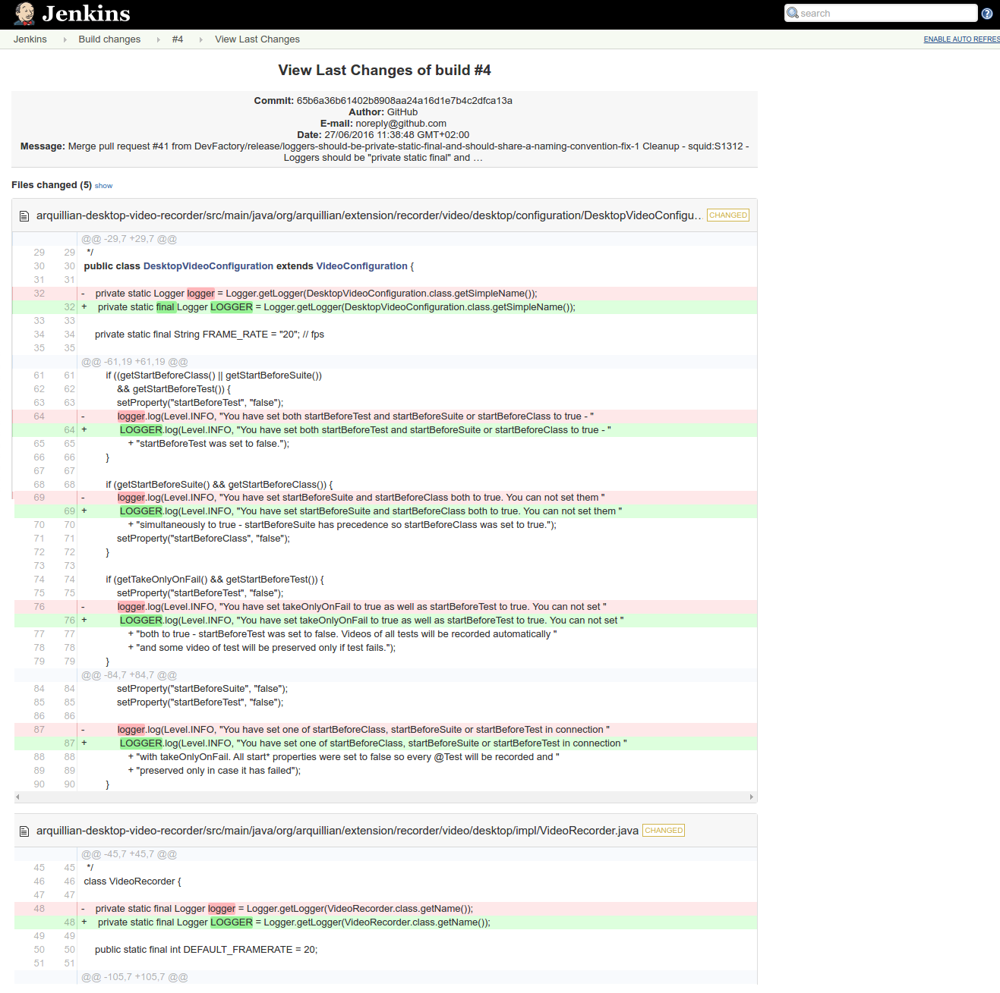
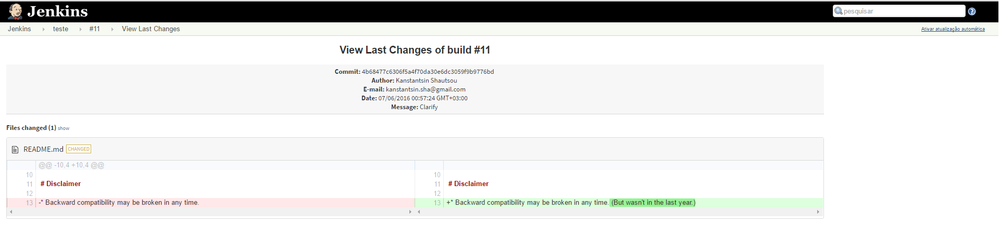
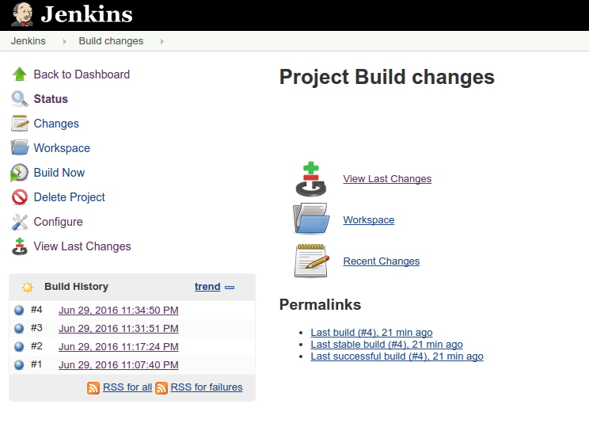
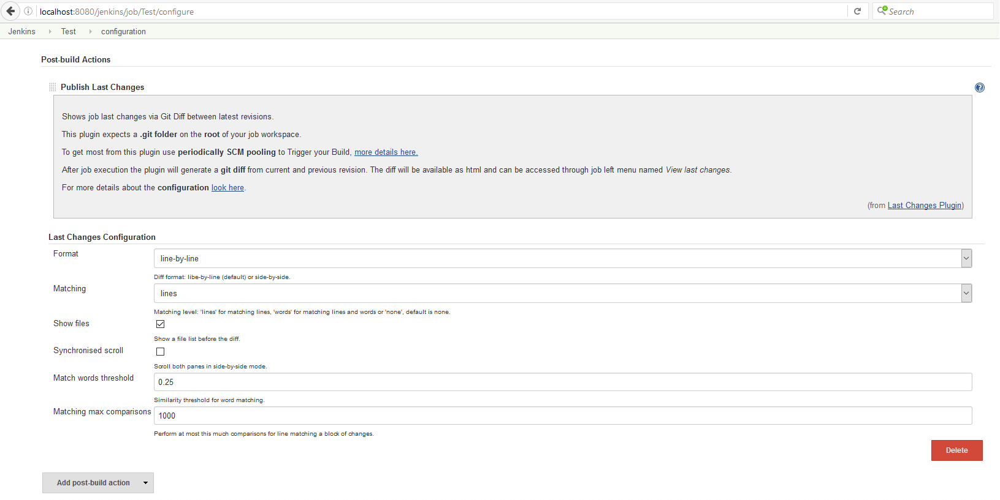
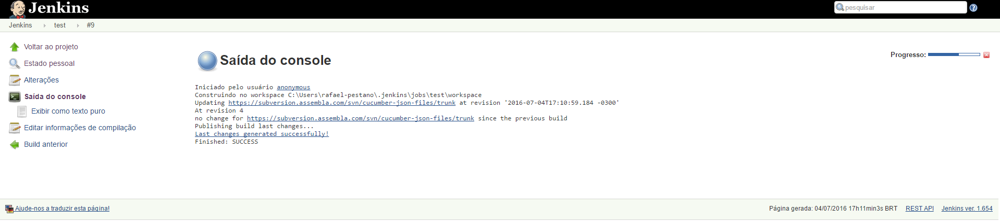

= Last Changes Plugin
:toc: preamble
:sectanchors:
:sectlink:
:numbered:
:tip-caption: :bulb:
:note-caption: :information_source:
:important-caption: :heavy_exclamation_mark:
:caution-caption: :fire:
:warning-caption: :warning:

image:https://travis-ci.org/rmpestano/last-changes-plugin.svg[Build Status (Travis CI), link=https://travis-ci.org/rmpestano/last-changes-plugin]

image:https://jenkins.ci.cloudbees.com/buildStatus/icon?job=plugins/last-changes-plugin[Build Status (Cloudbees), link=https://jenkins.ci.cloudbees.com/job/plugins/job/last-changes-plugin/]

Last Changes is a *Jenkin plugin* that shows `rich` VCS diffs between builds.

IMPORTANT: Only `Git` and `Svn` are supported.

== Introduction

The plugin uses https://diff2html.rtfpessoa.xyz/[diff2html^] to show last changes of a given build, example:

Or using side-by-side configuration:

NOTE: Last changes means `compare current revision with previous one`.

== Objectives

One of the objectives of this plugin is to easily find the `root cause` of a *failling build* by highlighting what has changed.

Also the plugin _shines_ in a https://en.wikipedia.org/wiki/Continuous_delivery[*continuous delivery*^] environment, where each _commit_ generates a release candidate. In this case the plugin will show what has changed on a `possible release`.

== How it works?

. This plugin expects a `git` or `svn` based build.
. While your job runs the plugin reads your build workspace (.git or .svn) to generate VCS diffs;
. The diff between `actual` and `previous` revision will be stored on your build;
. The `diff` for each build can be viewed later in html format.

NOTE: To get most from this plugin use `periodically SCM pooling` to Trigger your Build, http://www.nailedtothex.org/roller/kyle/entry/articles-jenkins-poll[more details here^].

== Usage

After installation just activate the post build action named *Publish Last Changes*.

. Activate build action
+
image::last-changes-activation.png[]
. Last changes menu should be available
+

. Build changes history
+
image::last-changes02.png[]
. Last changes menu is available for builds that published changes
+
image::last-changes04.png[]

== Configuration

The setup id done via `build configuration` and basically reflects https://github.com/rtfpessoa/diff2html#configuration[diff2html options^]:

 
 
== Docker

An easy way to test this plugin is using a docker container, here are the steps (assumming you have docker installed):

. Run the image:
+
----
docker run -it -p 8080:8080 rmpestano/jenkins-last-changes
----
+
. Access localhot:8080/ and create a job
. Configure this svn repository: https://subversion.assembla.com/svn/cucumber-json-files/trunk/ 
. Add the *Publish last changes* _post build action_;
. Just run the job

 
Job output should look like:

 
